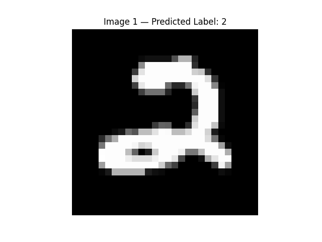
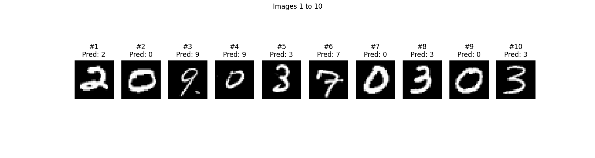
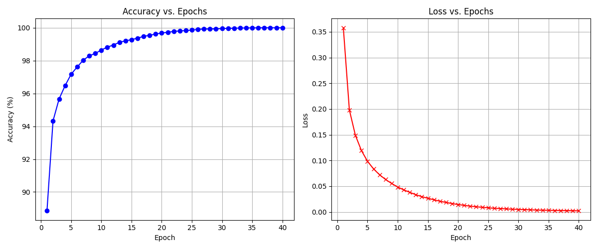

# MNIST Neural Network from Scratch (NumPy)

A fully connected feedforward neural network (Multilayer Perceptron) built from scratch using only NumPy — with no machine learning libraries like TensorFlow or PyTorch.  
The model classifies handwritten digits from the MNIST dataset and reaches up to 99.99% accuracy.

## About Me

Hello, I’m Dev Mangal, a first-year student at BITS Pilani Goa Campus.  
This was my first deep dive into neural networks and machine learning. At the start, I had no prior knowledge of neural networks, deep learning or NumPy, but I wanted to learn something meaningful in the AI/ML space.

What began as curiosity turned into a full project where I learned:
- How neural networks work
- How to implement them from scratch using NumPy
- How gradients, backpropagation, and loss functions really behave

I’ve always loved mathematics and thought AI was cool — but this project genuinely sparked a deep interest in machine learning that I want to continue exploring.

## Project Overview

- Goal: Classify handwritten digits (0–9) from the MNIST dataset
- Model: Multilayer Perceptron (MLP)
- Architecture: 784 → 128 → 64 → 10 with ReLU and Softmax
- Training: Stochastic Gradient Descent using mini-batches
- Best Accuracy: 99.99% (with Cross Entropy + Learning rate = 0.12 + Epochs = 30)
- Accuracy vs Epoch and Loss vs Epoch graph
- Personal Feature: Visualizer - used to view the predictions using matplotlib (see below)
- A feature to show how long training the network took, for experimenting on different functions etc.

## Training Results (Progress I Noticed)

| Epochs | Learning Rate | Loss Function   | Accuracy         | Batch Size | Training Time   |
|--------|----------------|----------------|------------------|------------|-----------------|
| 10     | 0.01           | MSE            | 95%              | 64         | N/A             |
| 15     | 0.01           | MSE            | 96%              | 64         | N/A             |
| 20     | 0.01           | MSE            | 97%              | 64         | N/A             |
| 20     | 0.005          | MSE            | 95%              | 64         | N/A             |
| 25     | 0.12           | Cross Entropy  | 99.7% – 99.8%    | 64         | ~120 sec        |
| 30     | 0.12           | Cross Entropy  | 99.97% – 99.99%  | 64         | >120 sec        |
| 30     | 0.12           | Cross Entropy  | 99.97% – 99.99%  | 64         | >130 sec        |
| 30     | 0.12           | Cross Entropy  | 99.8% - 99.9%    | 128        | ~60 sec          |
| 40     | 0.15           | Cross Entropy  | 99.99%           | 128        | ~80 sec       |

Switching to Cross Entropy and tuning the learning rate made a massive difference. Increasing the batch size meant
lesser training time but also caused a drop in accuracy, a balance of the number of epochs and batch size gave 99.99% accuracy
with acceptable training time.
Batch size of 128 is perfect for very high accuracy and low training time, for 30 epochs

## Dataset: MNIST

- 28x28 grayscale images of handwritten digits
- 42,000 training samples (with labels), 28,000 test samples (without labels)
- Preprocessed into train.csv and test.csv

## What I Learned

- Building a neural network architecture from scratch
- Forward pass, activation functions, and output layers
- Backpropagation and gradient descent using NumPy
- Loss functions: MSE vs Cross Entropy
- Mini-batch training and hyperparameter tuning
- Exporting predictions and visualizing test outputs
- Structuring modular Python code across multiple files

## Challenges I Faced

While working on this project, I encountered several challenges that helped me understand the concepts more deeply:

- Understanding the theory behind backpropagation and why it works
- Translating mathematical formulas into actual Numpy code
- Implementing the gradient updates
- Dealing with shape mismatches 
- Debugging issues in the visualizer when working with batches
- Structuring the code properly, then optimizing training time due to the file import path

Each of these took time and effort to solve — but they taught me how to think like an ML engineer instead of just a user of libraries.

## Folder Structure

- src                  - All source code
- image                - Visual output example from the model
- data                 - MNIST CSV dataset + output labels

## File Structure

- main.py              - Training loop, evaluation, label export  
- model.py             - Layer and Network classes  
- loss.py              - MSE and Cross Entropy loss functions  
- activations.py       - Activation functions and derivatives  
- mnist_loader.py      - Loads and preprocesses dataset  
- visualizer.py        - Optional tool to view predictions
- metrics.py           - Optional tool to view graphs  
- train.csv / test.csv - Required MNIST dataset files

## How to Run

1. Make sure Python is installed
2. Install dependencies:
   ```bash
   pip install numpy pandas matplotlib
   ```
3. Place train.csv and test.csv in the data/ folder
4. Make sure you are in the path to the project folder, if not run:
   ```bash
   cd C:/[your_path]/MNIST-Project
   ```

   Replace [your_path] with the relevant path
5. Run the training script:
   ```bash
   python src/main.py
   ```

After training:
- label.csv will be created with predicted labels for the test set
- You can also view predictions using the visualizer (see below)

## Optional: Visualize Predictions

You can view image-by-image or in custom-sized batches using:

Uncomment this in main.py to use:
preview_predictions(net, input_test)

When run:
- You’ll be prompted to enter a start index, how many images to view, and whether to view one-by-one or in batches
- Press Enter between batches to move forward

## Visual Prediction Example

Here’s a batch of predictions made by the network:

# One at a time


# Batch of images


## Optional: Accuracy vs Epoch, Loss vs Epoch graph

Here's an example of the graphs I got (with 99.99% accuracy):



The code that needs to be uncommented to view these is documented inside main.py.

## Technologies Used

- Python
- NumPy
- Matplotlib
- Pandas

## Acknowledgments

This project was made with help from:
- 3Blue1Brown — Neural Networks YouTube
- Stanford CS231n YouTube
- Sentdex YouTube
- ChatGPT (for guidance, debugging, and planning)